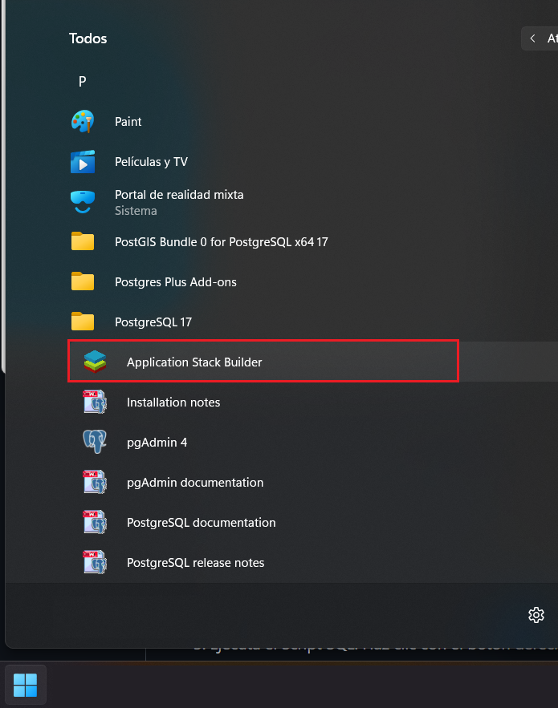
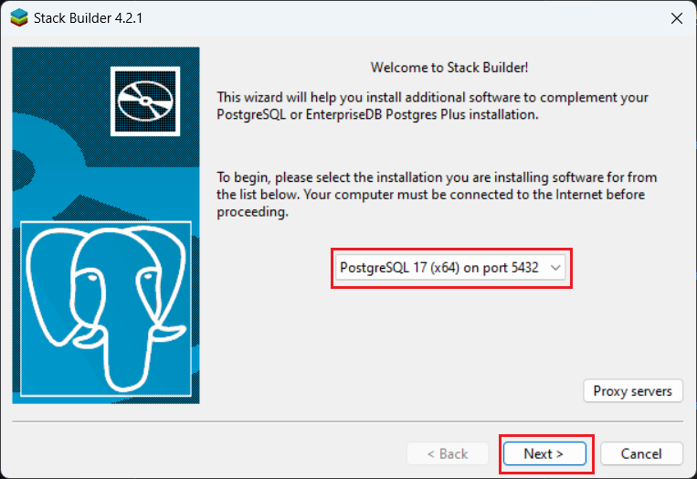
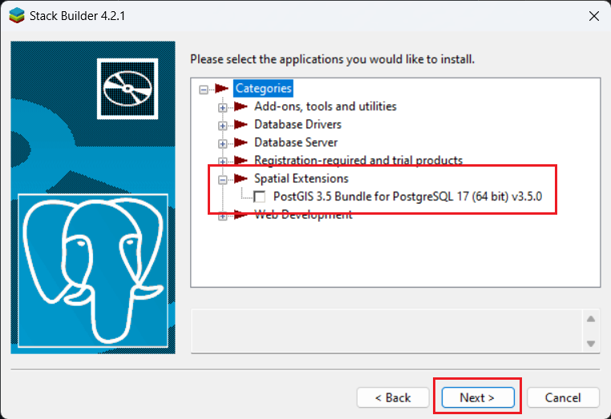

# Laboratorio 2 - Bases de datos Avanzadas
## Laboratorio desarrollado por el grupo n°8.
### Integrantes de grupo 8

* Arina Bilan
* Patricio Briceño
* Gonzalo Arévalo
* William Zubarzo
* Cristobal Flores

# Descripción del proyecto

El objetivo es diseñar y desarrollar un sistema para un E-commerce, donde se gestionen productos, órdenes de compra, clientes, inventario en tiempo real, zonas de reparto, tiendas o sucursales y repartidores. Garantizando que cuando un cliente realice una compra, el stock de productos se actualice automáticamente, y si el stock de un producto llega a 0, este se marque como “agotado”. Además que se le asigne un repartidor al cliente según la tienda o sucursal. Además de poder hacer un seguimiento mediante consultas, sobre la cercanía de clientes, repartos y pedidos respecto a una tienda específica.

# Recursos utilizados para el desarrollo del proyecto:

   ## Base de datos
   * Postgres SQL versión 16
   * PgAdmin versión 4
   * PostGIS 3.5 Bundle for PostgreSQL (add-on)

   ## Backend
   * IntelliJ IDEA Ultimate
   * JDK versión 17
   * Postman

   ## Frontend
   * VUE versión 3
   * Node.js versión >=16
   * Visual Studio Code (VSC)

# Guía de Instalación y Ejecución
Esta guía ayudará a configurar el entorno de desarrollo para trabajar con IntelliJ IDEA, PostgreSQL, pgAdmin, y ejecutar un proyecto de Vue.js

## 1. Clonar el repositorio

git clone https://github.com/wittyZzZ/TBD_LAB_2

## 2. Instalación de Node.js

1. Descargar Node.js desde el sitio web oficial: [Descargar Node.js](https://nodejs.org/es/download/).

## 3. Instalación de IntelliJ IDEA

1. Descargar IntelliJ IDEA desde el sitio web oficial: [Descargar IntelliJ IDEA](https://www.jetbrains.com/idea/download/).

2. Instalar IntelliJ IDEA siguiendo las instrucciones específicas para el sistema operativo.

## 3. Instalación de PostgreSQL y pgAdmin

### 3.1 Instalación de PostgreSQL

1. Descargar PostgreSQL desde el sitio web oficial: [Descargar PostgreSQL](https://www.postgresql.org/download/).

2. Seguir las instrucciones de instalación para el sistema operativo.

### 3.2 Instalación de pgAdmin

1. Descargar pgAdmin desde el sitio web oficial: [Descargar pgAdmin](https://www.pgadmin.org/download/).

2. Instalar pgAdmin siguiendo las instrucciones para el sistema operativo.

### 3.3 Instalación de PostGIS 3.5

1. Abrir el menú principal de Windows, buscar el grupo PostgreSQL y dar click en Aplicación Stack Buillder (Gestor de paquetes de Postgresql), seleccionar la base de datos (PostgreSQL 16 on port 5432) y presionar el botón **Next**

2. Buscar y expandir **Spacial Extensions**, marcar la casilla PostGis 3.4 Bundle for PostgreSQL, presionar el botón **Next** para que el Add-on se instale y finalizar la instalación.

   
Ver más detalles

   Buscar y seleccionar Aplicación Stack Buillder
   

   Seleccionar la base de datos
   

   Seleccionar **Spacial Extensions**
   

## 4. Crear base de datos y cargar información

### 4.1 Mediante línea de comandos

1. Abrir una terminal en la carpeta donde se encuentran los archivo SQL que se desea ejecutar. En este caso abrir consola en carpeta "database".

2. Ejecutar los siguientes comandos en orden:
      * psql -U postgres -f dbCreate.sql
      * psql -U postgres -f loadData.sql
      * psql -U postgres -f triggerCreate.sql

Importante: se usa usuario "postgres" para conectarse a la base de datos. Si se utiliza un usuario diferente, reemplazar "postgres" por el nombre del usuario correspondiente.

### 4.2 Mediante pgAdmin

1. Asegurarse de estar conectado a PostgreSQL con pgAdmin:
   Abrir pgAdmin y conectarse al servidor PostgreSQL.
   Si aún no hay una conexión configurada, se puede hacer siguiendo las instrucciones de pgAdmin.

2. Seleccionar el servidor y la base de datos:
   En el panel izquierdo de pgAdmin, seleccionar el servidor PostgreSQL.
   Luego, seleccionar la base de datos en la que se desea ejecutar el script SQL. Si no hay una base de datos existente, se puede crear haciendo clic derecho en "Databases" y seleccionando "Create" > "Database".

3. Ejecutar Scripts de  SQL:
   Hacer clic con el botón derecho en la base de datos seleccionada y elegir "Query Tool" para abrir una ventana donde se podrán ejecutar consultas SQL.

4. En la ventana del "Query Tool", abrir el archivo SQL que contiene el script que se desea ejecutar. Se puede hacer seleccionando "File" > "Open" y navegando hasta la carpeta "database" en la cual se encuentran los archivos SQL.

5. Una vez abierto el archivo SQL, se puede ejecutarlo haciendo clic en el botón "Execute".

NOTA IMPORTANTE:
	1. Los script están diseñado para ejecutarse en la terminal de PostgreSQL (psql).
	2. Si se va a ejecutar en pgAdmin, eliminar o comentar comandos específicos de psql, como:
      		- \c <database_name>
      		- \encoding UTF8

6. Los scripts a ejecutar son los siguientes, en orden de ejecución:

   * dbCreate.sql
   * loadData.sql
   * triggerCreate.sql
     
### 4.3 Verificar la Carga de Datos

Después de ejecutar el script, verificar que los datos se hayan cargado correctamente en las tablas correspondientes. Para ello, se puede ejecutar una consulta SQL simple en pgAdmin o en la terminal de PostgreSQL.

## 5. Revisión de código y Ejecución de backend:

1. Abrir IntelliJ IDEA y seleccionar File -> Open, abrir carpeta "lab_1"

2. Ejecutar "mvn clean install" para instalar las dependencias necesarias descritas en el archivo pom.xml

3. Ejecutar directamente backend desde IntelliJ IDEA

## 6. Revisión de código y Ejecución de Frontend:

1. Abrir VSC -> open folder -> seleccionar tbd_frontend_1

2. Abrir una terminal en VSC y ejecutar los siguientes comandos:

   * Ejecutar "npm install" para instalar las dependencias necesarias descritas en el archivo package.json

   * Ejecutar "npm run serve" para iniciar el servidor de desarrollo de Vue.js.

3. Abrir el navegador web y navegar a la dirección http://localhost:5173/ para ver la aplicación de Vue.js en funcionamiento.

## 7. Funcionalidades especificas a desarrollar

1. Mostrar las órdenes que han sido enviadas a clientes dentro de un radio de 10 km desde un almacén específico.

2. Listar los repartidores que han entregado pedidos en una zona específica definida por un polígono (zona de reparto).

3. Determinar cuántos repartidores operan dentro de un área de 30 km alrededor de la tienda principal.

## 8. Login en aplicación web

* Existen 29 usuarios cargados en la base de datos, y para loguearse con uno de ellos el nombre de usuario es "user_i" (con i = {1,2,3,...,29} ) y la contraseña es "123" para todos.

